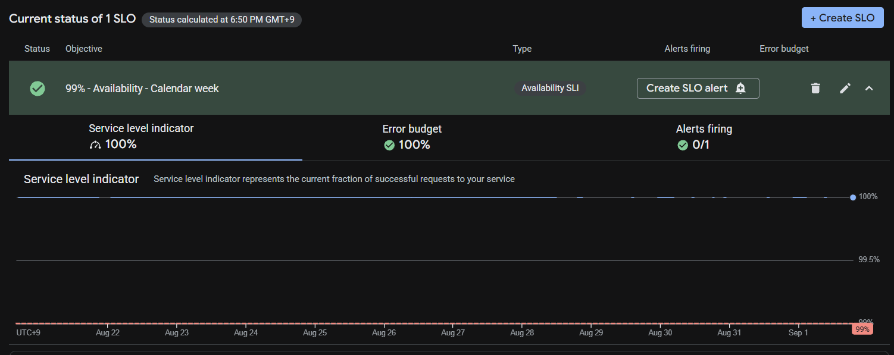
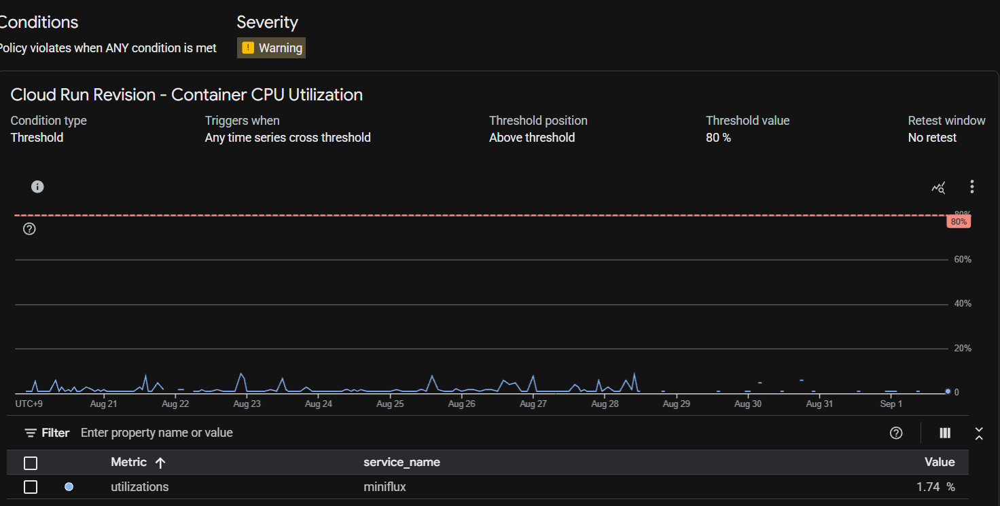

# Miniflux Cloud Platform

Infrastructure and CI/CD for deploying and operating a personal [Miniflux](https://github.com/miniflux/v2) instance.

I'm starting with GCP and will expand to AWS and Azure as the project develops.

The goal of this project is to explore and demonstrate practical systems engineering practices around infrastructure, automation, security, and reliability using a real open-source application.

In order to be gentle to my wallet, I am using Supabase as a Postgres Host instead of a full on CloudSQL implementation. There are drawbacks like a lack of snapshotting, and lack of Google IAM Authentication, but I am proficient in GCP CloudSQL administration.

Github is my source of truth and CI/CD interface. HCP Terraform provides centralized remote state and execution.

## GCP

### Secrets

All application secrets live in GCP and were manually populated after creation.

The initial setup of Terraform Cloud Workspace required a Service Account key that was used one time to provision the Workload Identity pools so that I could leverage that instead of a long lived key. Read more about Workload Identity [here](https://www.hashicorp.com/en/blog/access-google-cloud-from-hcp-terraform-with-workload-identity)

### Monitoring

There is a Service Level Objective alert that will fire if 1% of requests fail in a given weekly period.

There is a an alert that will fire if the average CPU usage goes above 80% in any 5 minute period.

